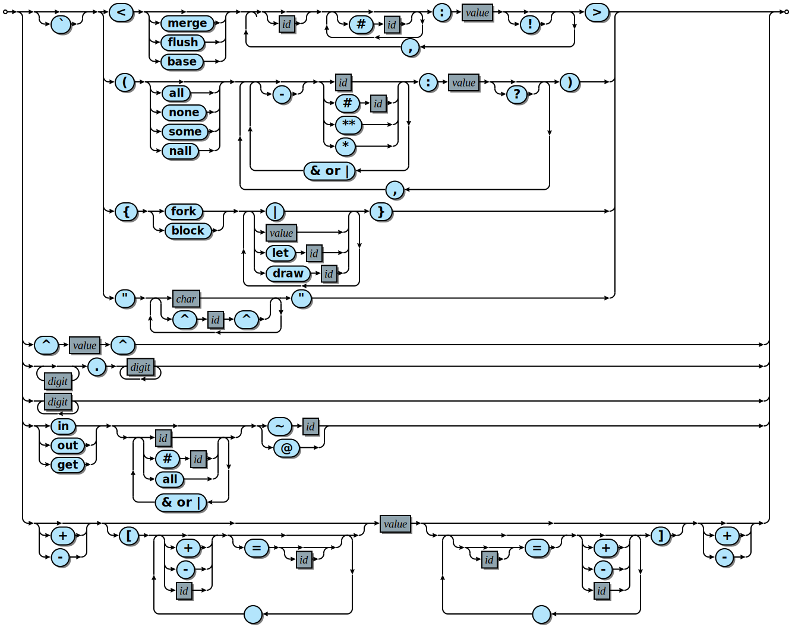
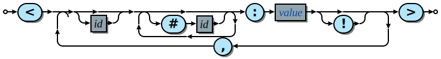
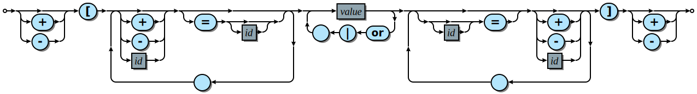

# Silk

__A language of elegance where data flows are woven freely and expressively, where symettry and asymettry, push and pull are balanced and harmonized into an immaculate tapestry of forms.__

## Motivation

Programming is ugly, and this makes creating programs more arduous than it needs to be. Silk is an attempt to create a programming language based on conceptual balance and neccessity. At first it will likely appear strange and esoteric, rather than beautiful because it is so different to what most of us are used to. It operates without classes, functions, variables and for-loops. It is believed these are what create the asymettry that ultimately causes us to write twisted, intractable and verbose code.

The world we see is one distorted by the concepts we are familiar with, though they may be ultimately arbitrary in the grand schema. This project is an attempt to create a language which challenges our ideas about programming and hopefully leads to a leap forward in the effectiveness of our collective intellect commanding information technology.

Many languages have libraries with toolkits for streams, queries, asynchronicity, functional programming and other important tasks that should be more naturally expressed with the right syntactic forms. This is what this language will do seamlessly and hence offers the prospect of compiling onto many target platforms.

## Metaphysics
The bi-dichotomy of substance

#### Axis 1: Nature: Mind and Body
  - Determinate existence is that of bodies, complex and simple, which are all objective creation. Write, Push, Positive, Yang, Synthesis
  - Experienced existence is that of minds, complex and simple which is the subjective awareness of all things. Read, Pull, Negative, Yin, Analysis
#### Axis 2: Mode: Manifest and Ephemeral
  - Our reality, including it's composite parts of both Natures is actual and operational, including by extention all there is to see and touch.
  - Our ideality, the space of all values concievable, the platonic space of concepts according to all that may be created and experienced.

programming is the art of combining, and translating between the above aspects.

### A Dualistic Language
silk has two categories of language expression, that belong to the analytic and synthetic facilities of the language. These two kinds have different interpretations of identifiers, the analytic treats identifiers as outputs, that represents the result of the analysis, synthetic treats identifiers as inputs that represents the sources of determination for the final product.

One may consider this distinction as equivalent to the mind and body, one is tasked with experiencing and the other with enacting concrete change. The interplay of these elements is what drives computation and they are mutually dependent without objects to analyse cognition is useless and without recieving stimulus there is no way to produce appropriate responses.

While treated as distinct natures with different syntactic possibility, both forms(indeed all forms) become a unified node type known as a cell. Cells have 3 features
- a pair of primary input and output ports
- any number of nominal input and output channels
- a pair of eyes to see the inputs and outputs of the surrounding context.

So usually the arguments and methods available to operate are defined by the header of the function/class. Here we determine what inputs and outputs appear on our cells simply by referring to them or that is implicit to the context.

in a construct whose primary output is the composed result, treats portal expressions as inputs that are sources of determination.

in a visor whose primary input is the object to decompose, treats portal expressions as outputs that are sinks to disseminate.

in a series our primary input is at the beginning which flows through its child cells in sequence to it's end which is it's primary output.

the series must be explicit about it's inputs and outputs and may compatibilise by rebinding of channel names, channels that are opened at input will send forward in the sequence to the subcells that accept those channels as inputs and subcells that send on particular channels will be passed out where the output is openned

There is between these distinct forms a common abstract type which facilitates the transfer of information between points of a program, these nodes are called contacts, a contact is either an input or an output and can be downstream or upstream (respectively) from zero or more corresponding outputs and inputs. A contact belonging to a node can

Object Literals and Destructure patterns
Macros and streams

Code is a representation of a process, such a process that may accept data as input and produce data as output. data is merely a process which has only one possilbe outcome, which is it's own representation. Therefore data is subset of code. Then what does code include? it includes the means to produce different results, depending on what input it is given.

There are two forms of composite, constructs and vacuums. A construct is positive, the force acting to define. A vacuum is negative, the force that seeks definition. The presence of both forms is what drives computation.

the treatment of output and input is symmetric. it is possible to seek a source to draw as much as it is a sink to put into.

data goes one way: from a fullness of data to a void of data. Therefore it is not neccessarily the way of the input to the output, if the input is itself a void.

you must decide what is literal and what is manifest, a process literal can be produced and provided as input, in order to be compiled to become a process it must manifest. To be manifest is to be attached in exactly one space. The attachment hierarchy carries to the absolute root and contains by extension all manifest processes. a literal can be interpreted as process or left as representation though eventually will become a primary representation in a terminal context, a string of characters in a console or pixel array of an image.

to determine how representations are treated there are a number of distinct natures which apply to a space and are determined by the use of keyword context modifiers.

How do we distill the essence of a system to it's most comprehensible and operable representation? This is the ultimate question and it hints at it's own solution. When we consider distilling the essence to be the compilation of code which is a representation of a system that is both comprehendig and operating.

at the heart of silk are a few important learnings, these are the fundamental design drivers that ultimately makes the tapesty flow nicely.

## Grammar

### Value
the most generic parsing context is the value, that is an expression which is parsed to become a single unit of computation, data and interoperability, which can be leveraged in a variety of contexts. values are have either complex or simple forms which differ in that complex forms can be templated to become higher order literals using a backtick(\`).



#### Construct
The definition of a structure of many parts requires a construct form. It is similiar to most object literal syntax forms but with some additional keywords and signs. The parts are the container modifiers, which determine how the input to the root of this structure is treated. The optional identifier and tags then a value container optionally followed by a neccessity marker (!)


our 2 fundamentally distinct behaviours are whether to swallow and manifest or to transform input. That is to be modified or to perform a process. Since a process literal attempts to emit
- base:
-

### Visor
A visor is a structure whose primary function is to scan incoming data and produce appropriate output, therefore it serves the role of dereferent, iterator, reducer and conditional. The default mode is a filter which outputs the parts of the incoming structure that match  


### Contact
contacts are the means for different parts of a program communicate with one another




## Usage

#### Installation
one line install for latest stable platform binary and standard library

```console
curl https://silklang.io/install.sh | sh
```

#### New Project
begin a new silk project in the current directory on the specified platform
```sh
silk init platform-name
```

#### Running
start a silk program
```sh
silk runE
```

#### Compiling

#### Module Install
download the module
```
silk install module-name
```
events
Timestamps
Versions


## Execution Models

the syntax and core forms described could potentially encode for a plethora of different behaviours depending on how the implementions treat topics such as asynchronicity, blocking, recursion.

In essence the code produces an abstract syntax tree which is turned into an execution graph which becomes a number of buffers, executor threads and platform calls that are modelled in the implementing language.

The idea is to have a precise specification for how the language produces a graph which could be interpreted in a variety of distinct operational contexts, from Infrastructure as Code, to LLVM bytecode to

It is not however a one directional affair, there are certain actions which will modify the graph itself and these are essential to the operation to work not from the ground but also from within the program itself.
