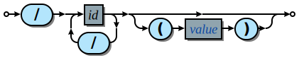
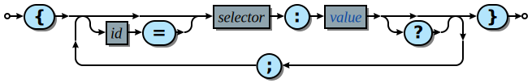

## Silk Syntax

### Terminals
references, identifiers, and primative literals such as strings and numbers,

positive entities have a product that reflects their own content, negative entities have a product that reflects external content.

### Module
all silk files correspond with a singleton module object. A module is a namespace mapping local names to values defined within and other modules using absolute and relative references. Thereby a directory which is the app root, will contain a root file which refers to other files under the directory, ultimately resulting in a flat collection of values, referring to one another by their local names.

When native plugins are created in other languages the files/builds should adhere to the same interface as the silk module

### Value
the most generic parsing context is the value, that is an expression which is parsed to become a single unit of computation, data and interoperability, which can be leveraged in a variety of contexts.

a value

### Reference

references are always references to top level values, they are always referring to locally bound values, except when they are a top level value, then they are a reference to an external module. A reference can include parenthesis, which means to

#### Construct
The construct is the means for creating composite data structures. It is similiar to many object literal syntax forms but with some key distinctions. The form is a sequence of signifier, value pairs seqarated by a colon. Signifiers include identifiers, tags and may also be empty, the corresponding value is the generic value.

The role of the construct is to produce composite data, each of its component's outputs produces a representation will become part of it's own output representation.

### Visor

If the construct is the positive composite a visor is the negative, it is specifically for pulling apart incoming structure and treating those parts seperately.

it's structure is similar except rather than signifiers it has designators, which has the reverse function where one is the statement the other is the question.
Questions are a bit more complex because they involve combinative logic operators, and ranges.

serves the role of dereferent(usually .), iterator(usually for/each) and conditional. The default mode is a filter which outputs the parts of the incoming structure that matches the

### Contact
contacts are the means for different parts of a program communicate with one another

### Chain
a chain is a sequential composition of functioning elements where each

### Operations
