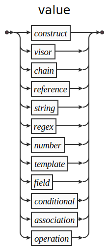
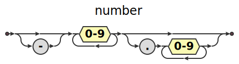
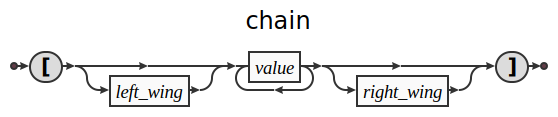
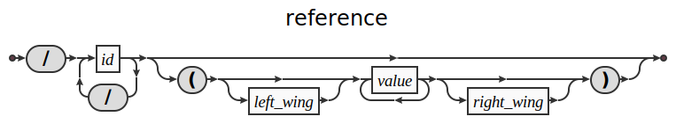
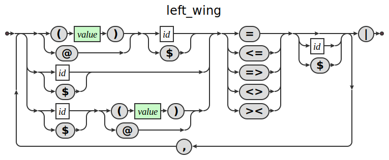
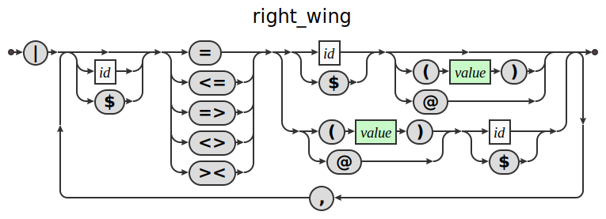
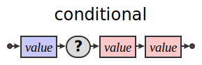
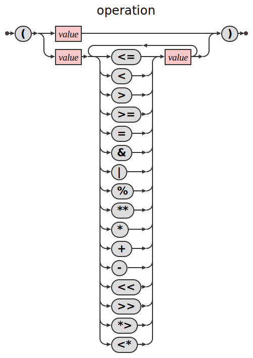
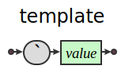
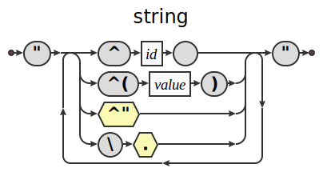

## Silk Syntax

### Module
all silk files correspond with a singleton module object. A module is a namespace mapping local names to values defined within and other modules using absolute and relative references. Thereby a directory which is the app root, will contain a root file which refers to other files under the directory, ultimately resulting in a flat collection of values, referring to one another by their local names.


When native plugins are created in other languages the files/builds should adhere to the same interface as the silk module

### First Class: Value
the core parsing context is the value, that is an expression which is parsed to become a single unit of computation, data and interoperability, which can be leveraged in a variety of contexts. Broadly a value can be a Primative, a Composite, a Special Form or Template Form.



### Primative Types

primative types produce their own representation and nothing else. Strings are dealt with later as template types because they may be interpolated to produce other values.

#### symbols
these are used primarily as program entity identifiers and can be passed around like other values for the purpose of only being equal to their own value.

#### numbers
one type of number exists in the language which will internally figure out which byte representation to use.


#### boolean
it's either ```True``` or ```False```, the result of comparative operators and matching expressions used to switch conditional expressions.

### Composite Types
All composite types are spaces containing a sequence of values and there are 4 which correspond to the composing, branching, translation and abstraction

#### Construct
The construct is the means for creating composite data structures. It is similiar to many object literal syntax forms but with some key distinctions. The form is a sequence of signifier, value pairs seqarated by a colon. Signifiers include identifiers, tags and may also be empty, the corresponding value is the generic value.

The role of the construct is to produce composite data, each of its component's outputs produces a representation will become part of it's own output representation.


### Visor

If the construct is the positive composite a visor is the negative, it is specifically for pulling apart incoming structure and treating those parts seperately.
it's structure is similar although where constructs treat associative keys as the keys of the product the visor has the reverse function of using those keys to deassociate the product.


### Chain
a chain is a sequential composition of elements where each is connected in the order they appear in sequence



### Reference

references are absolute references to file/module level values, they are always referring to locally bound values, except when they are a top level value, then they are a reference to an external module. A reference can include parenthesis, which means to instantiate the form in context.

to instantiate a form we push the initialization structure to it's primary input and then draw from it's primary output to get the representation to be created



### Wings

the wings appearing in composite types are sequences of _gateway_ expressions which serve as declarations of what ports will be admitted and how they will be referred to internally. There is a _left wing_ for input port admission and a _right  wing_ for output port admission, They are mirror images of one another which is one of the more unique



### Special Forms

#### Association
most languages treat keys as part of the scope, hash map, or object that is being created, in silk a key-value pair is a value itself whose first part is any value intended to be used as it's name and the second is the value which will manifest in the context it appears. This means a _set_ operation can be sent down a channel and use the same interface as appending a value.


#### Portal
portals are the means for different parts of a program communicate with one another a portal can be either receptive or aware. An aware portal has a value before its tilde, this value is matched against the associations of it's local space to find the item whose channel to draw from / send to.


#### Conditional
conditionals are like javascript's terniary conditional operator. The first value is the test which is a manifest context that will determine the path of the event, the true path is the second argument and the false path is the third.



#### Operation
in order to accomodate binary comparisons and arithmetical operations on values we use parenthesis to capture an expression where the operands are evaluated and passed in to the operator to create a result. Thus these forms are always many inputs converging to a single result.



### Template Forms
Macros and templates are often considered to be an advanced feature, in silk it is the means to create higher order systems and abstractions. Syntactically it is either a back tick followed by any value, or a string. The template is therefore capable of creating

#### value templates
In the first instance within the template value, an uptick followed by another value is a template field. The field of a template is an input only value mount which will recieve from the templates input channels.




#### string template
String interpolation is an essential feature for any modern language, it preferable to concatenation and formatting styles of string creation. A template field in a string is an uptick followed by parenthesis which contain the manifest part of the template that generates the template.



#### higher order templates
templates are themselves representations to be generated and therefore an ambiguity of what level the field is referring occurs. To circumvent this it is possible to double up the escapes. One may think of it as when rendering the value the double escapes will have one tick removed. the number of backticks before a value is equal to
